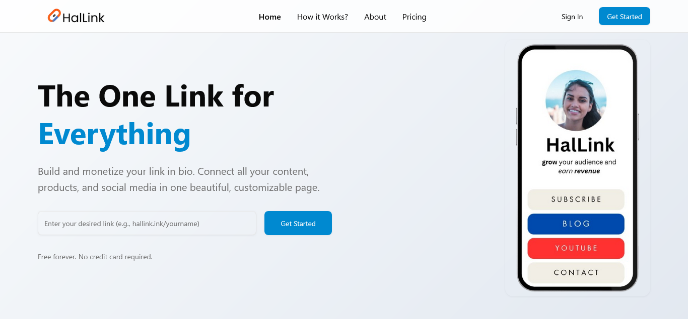
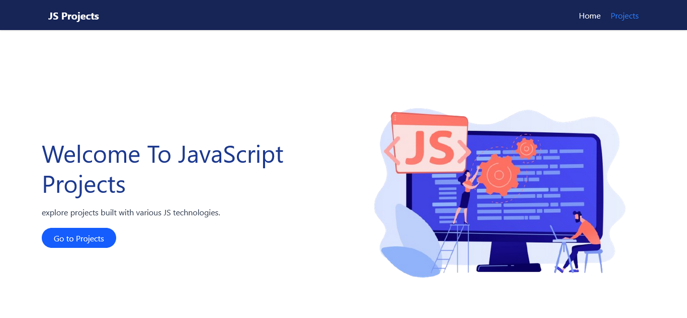

# 🌟 Abdiaziz's Portfolio


Welcome to my **Portfolio**! This repository highlights my projects, skills, and experience as a software engineer and web developer. Explore my work, live demos, and technologies I use.

---

## 🚀 About Me

Hi! I’m **Abdiaziz Jama**, a passionate software engineer and web developer. I specialize in building modern, responsive, and high-performance web applications. I enjoy solving challenging problems and creating tools that make a real impact.

**Highlights:**
- Co-founder of [HalLink](https://halink.ink) – a link-in-bio platform for Content creators  
- Experience with **React**, **TailwindCSS** and **Node.js**
- Enthusiastic about **AI**, **Web development**, and modern web technologies  

---

## 💻 Tech Stack

### Frontend


### Backend


### Database


### Other Tools


---

## 💼 Projects Showcase

### 1. **HalLink**

**Description:** A modern link-in-bio platform for Somali creators to showcase their work, social links, and content.  
**Technologies:** React, TailwindCSS, Vite, Node.js  
**Live:** [halink.ink](https://halink.ink)  
**Repo:** [Private](#)

### 2. **List of JavaScript Projects**

**Description:** A collection of all my JavaScript applications
**Technologies:** React, Node.js, tailwind API 

**Live:** [Live Demo Link](https://0paziz.github.io/javaScript-projects)  
**Repo:** [GitHub](https://github.com/0paziz/javaScript-projects)


## ⚡ Getting Started

1. **Clone the repository**
```bash
git clone https://github.com/0paziz/My-Portfolio.git  
```
2. **Navigate to the project directory**
```bash
cd portofolio-app 
```

3. **Install dependencies**
```bash
npm install
```


4. **Run the development server**
```bash
npm run dev

Open your browser at http://localhost:5173

```

### 📬 Contact Me
- Website - [Abdiaziz Jama](https://github.com/0paziz/My-Portfolio)
- Email - itzabdiaziz@gmail.com
- Linkeding - [@abdiaziz-omar](https://www.linkedin.com/in/abdiaziz-omar-876b06256/)


**⭐ Support / Follow Me**

If you like my work, give a ⭐ on this repo and follow me for updates